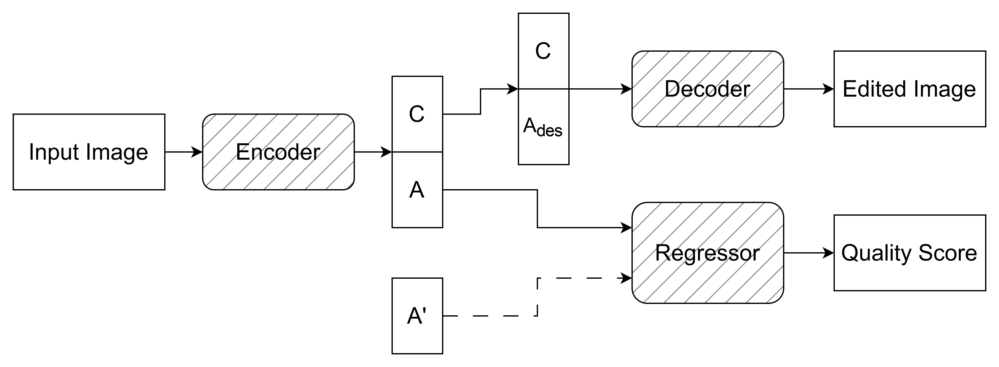
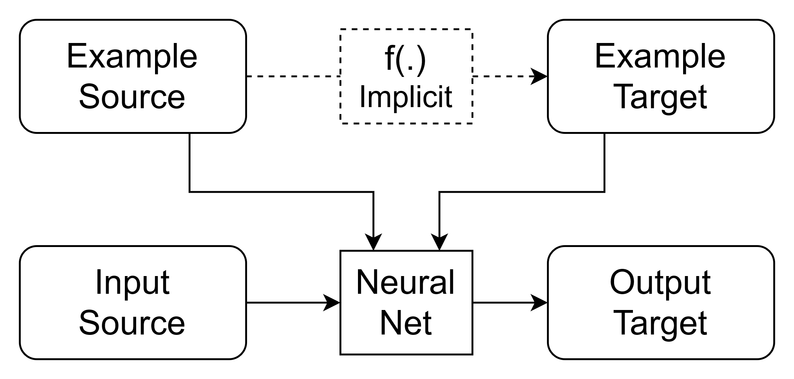
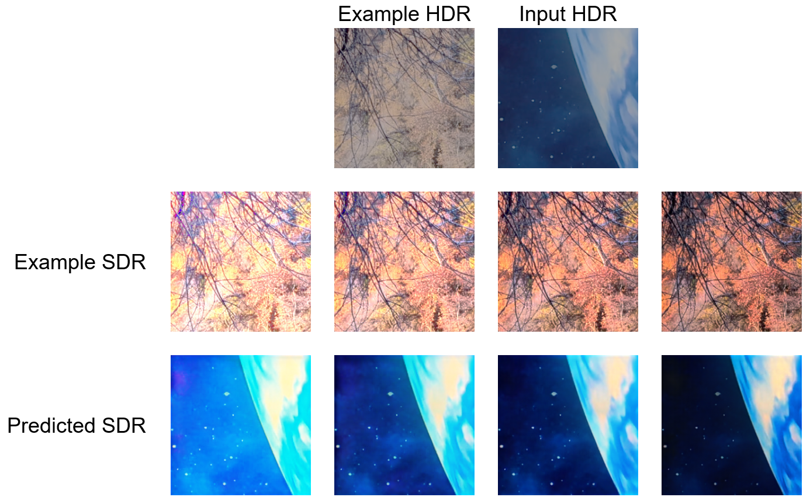
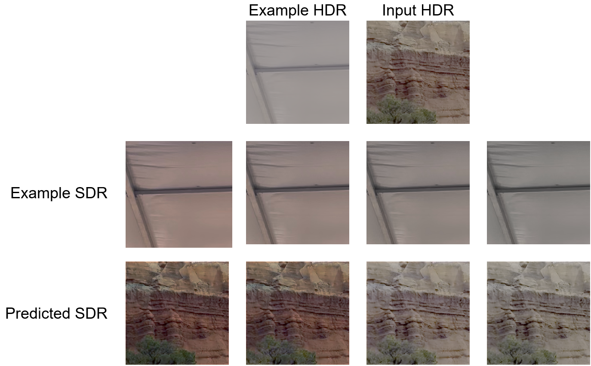
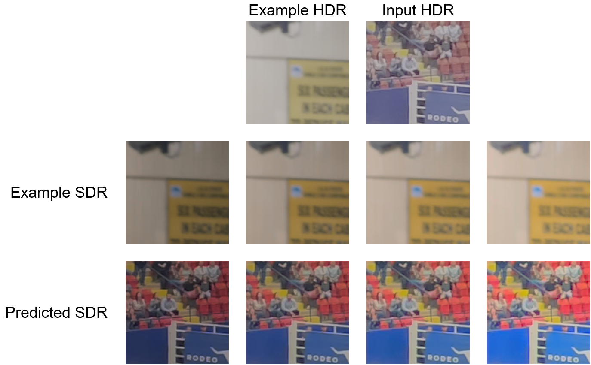
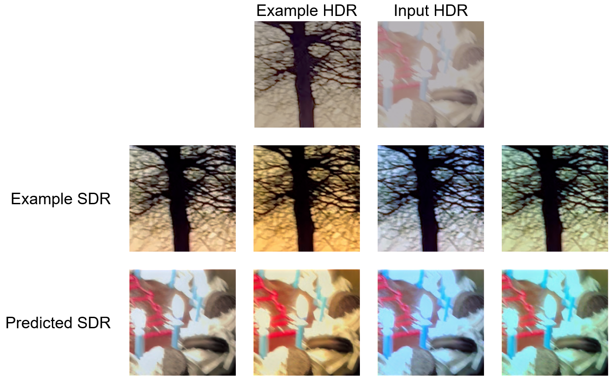

# DisQUE
This repository contains the official implementation of the DisQUE model proposed in the following paper.

1. A. K. Venkataramanan, C. Stejerean, I. Katsavounidis, H. Tmar and A. C. Bovik, "Joint Quality Assessment and Example-Guided Image Processing by Disentangling Picture Appearance from Content," arXiv preprint 2024.

DisQUE is a multi-purpose deep network that uses disentangled representations to perform both tunable image processing/enhancement using the novel paradigm of example-guided image processing, and image quality prediction.



## Features of DisQUE
1. A disentangled representation encoder that decomposes an image into its content ("what the image is showing") and appearance ("how it looks") components.
2. A novel paradigm called example-guided image processing (EGIP) where the desired image processing behavior is specified at runtime using an example input-output pair. The relationship between the example images is inferred by the network and applied to the input image.
3. A novel "appearance mixing" approach to improve the robustness of EGIP.
4. A state-of-the-art self-supervised quality prediction model using the same DisQUE feature set.

### Example-Guided Image Processing


Humans and algorithms approach image processing tasks in different ways. Humans typically use subjective judgements of the appearance of an image when editing it, say using tools like Adobe Photoshop, Da Vinci Resolve, or Instagram filters. 

On the other hand, algorithms require specifying either a large number of human-generated paired examples, which may be cumbersome to obtain, or technical specifications of parameters such as contrast gain, non-linear gamma, etc. Moreover, as consumer preferences change over time and to personalize models to individual consumers, datasets (and trained models) and algorithm parameters must be updated periodically.

Example-Guided Image Processing bridges the gap between these two approaches by creating a model that uses a single example pair to define the desired image processing behavior. The inferred implicit relationship is then applied to the input image tobe processed.

## Usage
### Setting up the environment
Create and activate a virtual environment using
```
python3 -m virtualenv .venv
source .venv/bin/activate
```
Install all required dependencies
```
python3 -m pip install -r requirements.txt
```

Download pretrained model checkpoints and sample images
```
python3 download_data.py
```

### Perform Example-Guided Image Processing
To perform example-guided image processing, select an example input-output pair to specify the desired transformation, and the input to be processed. Then, run

```
python3 process_image_using_example.py --ckpt_path <path to trained model checkpoint> --source_range <pixel value range of source domain> --target_range <pixel value range of target domain> --example_source_path <source image of example pair> --example_target_path <target image of example pair> --input_source_path <input image in source domain to be processed> --output_target_path <path to save output image in target domain>
```

To reproduce the example-guided tone mapping results shown below, run
```
./process_all_sample_images.sh
```

### Extract quality features from one video pair
To compute features from one video pair for either the FUNQUE(+) models or the baseline models, use the command

```
python3 extract_features.py --ref_video <path to reference video> --dis_video <path to distorted video> --ckpt_path <path to trained model checkpoint>
```

For more options, run
```
python3 extract_features.py --help
```

### Extract quality features for all videos in a dataset
First, define a subjective dataset file compatible with [QualityLIB](https://github.com/abhinaukumar/qualitylib). Then, run
```
python3 extract_features_from_dataset.py --dataset <path to dataset file> --ckpt_path <path to trained model checkpoint> --processes <number of parallel processes to use>
```
*Note: This command computes features and saves the results to disk. It does __not__ print any features. Saved features may be used for downstream tasks - example below*

For more options, run
```
python3 extract_features_from_dataset.py --help
```

## Results

### Example-Guided Tone Mapping Using DisQUE
Examples of tunable tone mapping of high dynamic range (HDR) images are shown below.

### Tuning Contrast Using An Example

### Tuning Color Saturation Using An Example

### Tuning Brightness Using An Example

### Tuning Global Color Using An Example


## Quality Prediction Using DisQUE
DisQUE achieves SOTA quality prediction accuracy for both HDR tone mappinga and SDR images.

### Predicting the Quality of Tone-Mapped HDR Images

| Model | PCC | SROCC | RMSE
| ----- | --- | ----- | ----
| RcNet | 0.5985 | 0.5824 | 8.2417
| HIGRADE | 0.6682 | 0.6698 | 8.2619
| CONTRIQUE |  0.7360 | 0.7230 | 6.8476
| ReIQA | 0.7583 | 0.7812 | 7.2951
| Cut-FUNQUE | 0.7783 | 0.7781 | 6.4187
| MSML | 0.7883 | 0.7740 | 6.8090
__DisQUE__ | __0.8160__ | __0.8215__ | __6.3241__

### Predicting the Quality of SDR Images (SROCC Only)
| Model | LIVE-IQA | CSIQ | TID2013 | KADID-10k
| ----- | -------- | ---- | ------- | ---------
PSNR | 0.881 | 0.820 |  0.643 | 0.677
BRISQUE | 0.939 | 0.746 | 0.604 |  0.528
SSIM | 0.921 | 0.854 | 0.642 | 0.641
FSIM | 0.964 | 0.934 | 0.852 | 0.854
CORNIA | 0.947 | 0.678 | 0.678 | 0.516
LPIPS | 0.932 | 0.884 | 0.673 | 0.721
CONTRIQUE | 0.966 | 0.956 | __0.909__ | __0.946__
ReIQA | __0.973__ | __0.961__ | __0.905__ | __0.901__
__DisQUE__ | __0.970__ | __0.961__ | __0.922__ | __0.934__

## Contact
If you encounter any bugs or issues, or if you would like to make a contribution, please raise an [Issue](https://github.com/abhinaukumar/disque/issues)! Alternatively, you can contact me at [abhinaukumar@utexas.edu](mailto:abhinaukumar@utexas.edu) or [ab.kumr98@gmail.com](mailto:ab.kumr98@gmail.com).
